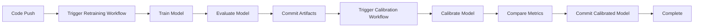

# GitHub Actions Lab 2 — Automated Model Training & Calibration

This Lab demonstrates how to use **GitHub Actions** to automate the full lifecycle of a machine-learning model — from **training**, **evaluation**, and **versioning** to **probability calibration** — using the **UCI Bank Marketing** dataset.

It follows an **MLOps-style continuous-integration workflow**, where each code push automatically retrains and calibrates the model, stores versioned artifacts, and logs metrics for reproducibility.

---

## Problem Statement

Predict whether a bank client will **subscribe to a term deposit** (`yes` or `no`) after being contacted by a marketing campaign.

**Goal:**  
Build a supervised machine-learning model that classifies customers into two groups:
- **1 → yes** – customer subscribed  
- **0 → no** – customer did not subscribe  

**Type:** Binary Classification  
**Algorithm Used:** Random Forest Classifier  
**Metric Focus:** Accuracy • F1 Score • Brier Score  

---

## 📊 Dataset — UCI Bank Marketing

**Source:** [UCI Machine Learning Repository – Bank Marketing](https://archive.ics.uci.edu/ml/datasets/bank+marketing)  
**File Used:** `bank.csv`  
**Rows:** ≈ 4,521  
**Columns:** 17  

| Feature | Description |
|----------|-------------|
| `age` | Age of the client |
| `job` | Type of job (e.g., admin, technician) |
| `marital` | Marital status |
| `education` | Education level |
| `default` | Has credit in default? |
| `balance` | Average yearly balance in € |
| `housing` | Has a housing loan? |
| `loan` | Has a personal loan? |
| `contact` | Contact communication type |
| `day`, `month` | Last contact day and month |
| `duration` | Last contact duration (seconds) |
| `campaign` | Number of contacts during this campaign |
| `pdays`, `previous`, `poutcome` | Past campaign details |
| **`y`** | **Target:** Subscribed ( yes / no ) |

---

##Project Structure

```
GitHub_Lab_LAB2/
├── .github/
│   └── workflows/
│       ├── model_retraining_on_push.yml
│       └── model_calibration_on_push.yml
├── src/
│   ├── train_model.py
│   ├── evaluate_model.py
│   └── calibrate.py
├── models/
│   ├── model_<timestamp>.pkl
│   └── calibrated_model_<timestamp>.pkl
├── metrics/
│   ├── metrics.txt
│   └── calibration_metrics.txt
├── requirements.txt
└── README.md
```

---

##Local Pipeline Overview

### 1. **Data Loading & Preprocessing**  
- Automatically downloads & extracts the UCI Bank dataset  
- Label-encodes categorical features  
- Splits data into training and testing sets

### 2. **Model Training**  
- Trains a `RandomForestClassifier(n_estimators=200)`  
- Saves the trained model → `/models/model_<timestamp>.pkl`

### 3. **Model Evaluation**  
- Loads test data and computes Accuracy & F1 Score  
- Writes results → `/metrics/metrics.txt`

### 4. **Model Calibration**  
- Uses `CalibratedClassifierCV(method='isotonic')`  
- Compares Brier Score & F1 before vs after calibration  
- Saves calibrated model → `/models/calibrated_model_<timestamp>.pkl`

---

## GitHub Actions Workflows

###Model Retraining Workflow (`model_retraining_on_push.yml`)

**Trigger:** Automatically runs on every push to `main` branch

**Steps:**
1. Checkout repository  
2. Set up Python environment  
3. Install dependencies from `requirements.txt`  
4. Run `train_model.py` to train the Random Forest model  
5. Run `evaluate_model.py` to compute metrics  
6. Commit new models and metrics back to the repository  
7. Push updated artifacts to `main`

**Example Output:**
```
models/model_20250120_143022.pkl
metrics/metrics.txt
```

---

###Model Calibration Workflow (`model_calibration_on_push.yml`)

**Trigger:** Automatically runs after model retraining completes

**Steps:**
1. Checkout repository with latest trained model  
2. Set up Python environment  
3. Install dependencies  
4. Run `calibrate.py` to perform isotonic calibration  
5. Compare Brier Score before and after calibration  
6. Save calibrated model and calibration metrics  
7. Commit and push calibrated artifacts

**Example Output:**
```
models/calibrated_model_20250120_143445.pkl
metrics/calibration_metrics.txt
```

---

## Getting Started

### Prerequisites

- Python 3.8 or higher
- Git
- GitHub account (for Actions)

### Installation

1. **Clone the repository:**
```bash
git clone https://github.com/yourusername/GitHub_Lab_LAB2.git
cd GitHub_Lab_LAB2
```

2. **Create a virtual environment:**
```bash
python -m venv venv
source venv/bin/activate  # On Windows: venv\Scripts\activate
```

3. **Install dependencies:**
```bash
pip install -r requirements.txt
```

### Local Execution

#### Train the Model
```bash
python src/train_model.py
```

#### Evaluate the Model
```bash
python src/evaluate_model.py
```

#### Calibrate the Model
```bash
python src/calibrate.py
```

---

## Dependencies

```txt
pandas>=1.3.0
numpy>=1.21.0
scikit-learn>=1.0.0
requests>=2.26.0
```

---

## Metrics Tracked

### Model Performance Metrics
- **Accuracy:** Overall classification accuracy
- **F1 Score:** Harmonic mean of precision and recall
- **Brier Score:** Measures calibration quality (lower is better)

### Before and After Calibration
```
=== Before Calibration ===
Brier Score = 0.0656
F1 = 0.4167
Accuracy = 0.9072

=== After Calibration ===
Brier Score = 0.0621
F1 = 0.4430
Accuracy = 0.9083
```

---

##CI/CD Workflow Visualization



---


## References

- [UCI Bank Marketing Dataset](https://archive.ics.uci.edu/ml/datasets/bank+marketing)
- [scikit-learn Documentation](https://scikit-learn.org/stable/)
- [GitHub Actions Documentation](https://docs.github.com/en/actions)
- [Probability Calibration in scikit-learn](https://scikit-learn.org/stable/modules/calibration.html)

---
